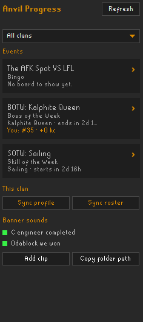
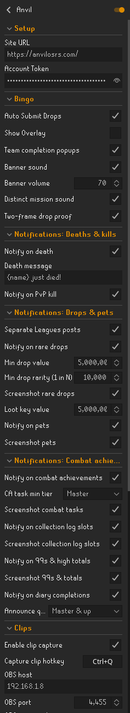
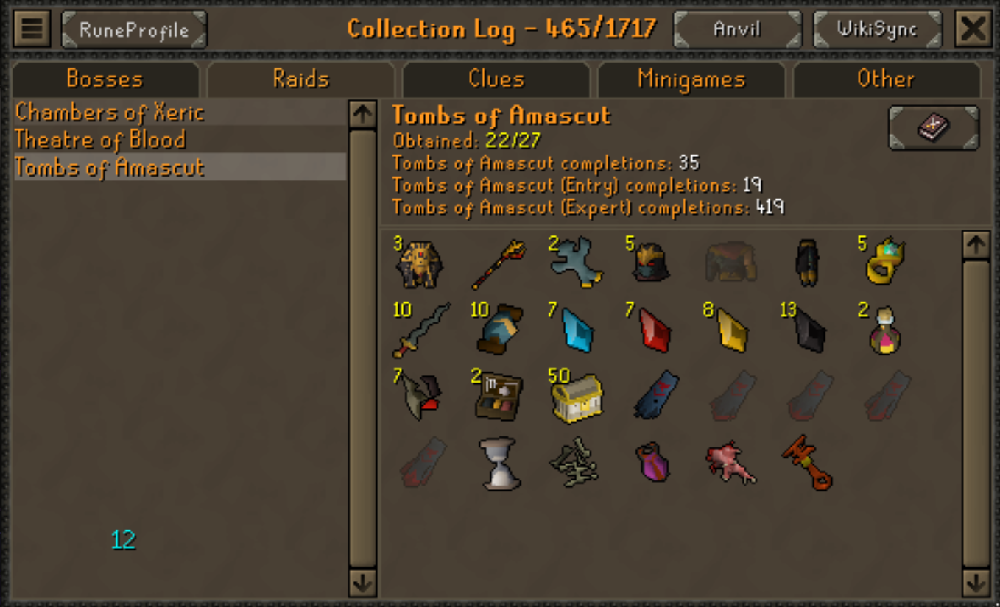
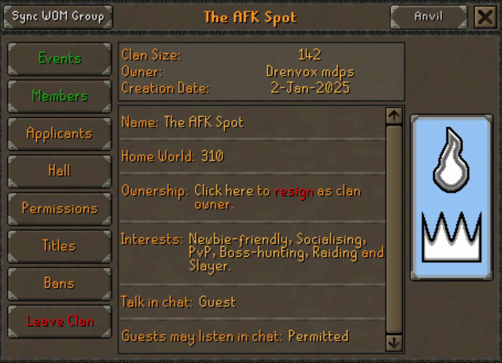
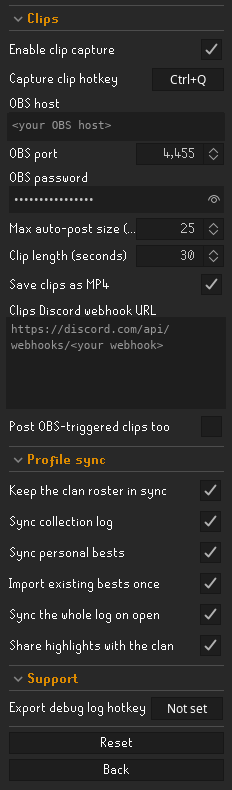

# Anvil

The RuneLite companion for **[anvilosrs.com](https://anvilosrs.com)** — where OSRS clans run their
bingos, their weekly SotW/BotW competitions, and their roster.

You install it once and point it at the site. After that it does the boring half of an event for
you: your drops get screenshotted and filed against the right tile, your kill counts and XP move the
board as you earn them, and the things worth shouting about land in your clan's Discord.

<p align="center">
  
</p>

## Get set up in two fields

1. **Install** — RuneLite → Configuration (the wrench) → **Plugin Hub** → search **Anvil** → Install.
2. **Point it at the site** — Configuration → Anvil → **Setup** → set **Site URL** to
   `https://anvilosrs.com`.
3. **Sign in** — open the Anvil side panel and click **Sign in with Discord**. Approve the code in
   your browser and the plugin fills your token in for you.

<p align="center">
  
</p>

One address covers **every clan you're in** — there's no per-clan URL and no per-event token. (Older
per-clan addresses still work, and self-hosters point at their own site instead.)

Can't run the plugin? You can verify an account on the website instead — see the
**[player setup guide](https://anvilosrs.com/guide/plugin)**, which walks through all of this with
screenshots.

## What it does

**Files your drops for you.** When something lands that a tile is watching, the plugin takes the
screenshot, stamps it, uploads it and files it against your team's board. No clicks. Two frames go
into each drop shot by default — one as it lands, one once the loot has settled — because that's
what stops arguments.

**Moves the board live.** Boss kill counts and skill XP push as you earn them, so a KC or XP tile —
and any weekly competition you're in — updates the moment you get the kill, rather than on the next
hiscores sweep.

**Tracks the things that aren't drops.** NPC kill counts, item gains from catching and cooking and
gathering, timed clears, deathless raids, LMS placements, achievement-diary tiers, and Combat
Achievement tasks. CA tiles even count tasks you cleared years ago — turn on
*Settings → Combat Achievements → Repeat completion* in game and re-meeting the conditions credits
it.

**Proves it happened.** A codeword drawn daily by the site, plus a UTC timestamp, is drawn on screen
and baked into every screenshot — so evidence can't be quietly back-dated.

**Posts to your clan's Discord.** Deaths, PvP kills, rare and valuable drops, pets, combat
achievements, collection-log slots, 99s, diaries and quests. You choose what you send; your admins
choose which channel it lands in.

**Keeps your profile current.** Your collection log and personal bests sync to the site, so your
profile there shows what you've actually done.

### In-game, where you already are

An **Anvil** button sits in the collection log's title bar next to WikiSync and RuneProfile — one
click syncs your log and your best times.

<p align="center">
  
</p>

The same button is in the clan window. If you're an admin or a moderator it pushes the in-game clan
roster to the site, keeping ranks and guest/member status right without anyone typing a list out.

<p align="center">
  
</p>

## Settings

Defaults are sensible — you can install it, set two fields and never open this again. Every setting
has a description in the plugin itself; this is the shape of it.

| Section | What's in it |
| --- | --- |
| **Setup** | Site URL and your Account Token. The only two that matter. |
| **Bingo** | Auto-submit, the verification overlay, team-completion banners and their sounds, two-frame drop proofs. |
| **Notifications: Deaths & kills** | Your death posts and your own death message; PvP kills (off by default). |
| **Notifications: Drops & pets** | Rare drops by value or by rarity, loot keys, pets, and whether each carries a screenshot. |
| **Notifications: Combat achievements** | CA tasks and tier clears, collection-log slots, 99s and totals, diaries, quests. |
| **Clips** | OBS replay-buffer clips on a hotkey, posted to a clips webhook. Off by default. |
| **Profile sync** | Collection log, personal bests, clan roster, and sharing highlights with the clan. |
| **Support** | Export a debug log to send an admin. |

A few worth knowing about:

| Setting | Default | Why you'd change it |
| --- | --- | --- |
| Show Overlay | on | Turn it off if you don't want the codeword panel on screen — proofs are still stamped. |
| Min drop value | 5,000,000 | The gp floor for a drop post. `0` switches value posts off. |
| Min drop rarity (1 in N) | 10,000 | Catches cheap-but-rare uniques. Looser than this and the channel fills with herb rolls. Your clan can set a floor; yours applies when it's stricter. |
| Loot key value | 1,000,000 | A loot key posts once, for its whole contents. |
| CA task min tier | Master | Set to Grandmaster for only the rarest tasks. Tier clears always post. |
| Notify on PvP kill | off | On, and your kills post with a screenshot of the tick they hit 0 HP. |
| Two-frame drop proof | on | Off makes drop shots single-frame. Keep it on. |

### Clips (optional)



Press a key, and the last few seconds are saved out of OBS and posted to your clan's clips channel.
Needs OBS 28+ with the WebSocket server and Replay Buffer on; the plugin starts the buffer for you.

Clips go **straight from your PC to Discord** — they never pass through the site, and with the
webhook field blank nothing uploads at all.

### Profile sync

Your collection log and personal bests, kept current on your profile. The whole log syncs when you
open it in game, or on the **Sync profile** button in the side panel. **Share highlights with the
clan** is what puts your pets, big drops and combat tasks on the clan's feed.

<br clear="right">

## In-game settings it leans on

The plugin says so in chat when one of these is off and it matters:

- **Loot drop notifications** (Settings → Chat) — the only signal for bosses whose loot spills out of
  a corpse rather than dropping. Keep its threshold at or below your Min drop value.
- **Combat Achievements → Repeat completion** — lets CA tiles count tasks you finished before the
  event.
- **Collection log → New addition notification** — credits shop, gamble and awarded log items that
  never fire a loot event.

## When something breaks

The plugin tells you in chat when tracking stops, and why. Nothing to check on a dashboard.

Failed submissions are kept on disk and retried with backoff, so a dropped connection or a server
restart doesn't lose a drop. Anything the plugin can screenshot but can't file against a tile — pets,
duplicate Champion's scrolls — is saved for you to attach on the site instead of scrambling for a
shot after the fact.

Still stuck? Type `::anvillog` in game chat. It writes a log to `.runelite/anvil-debug`, opens the
folder and copies the path — send that to your clan admin.

## Guides

Written against the live site, with screenshots:

- **[Player setup](https://anvilosrs.com/guide/plugin)** — this, in detail, including OBS clips
- **[Captain's guide](https://anvilosrs.com/guide/captain)** — reading the pool, draft day, running a team
- **[Running your first event](https://anvilosrs.com/guide/admin)** — for clan staff, start to finish
- **[Formats, and how tiles open](https://anvilosrs.com/guide/formats)** — board shapes and reveal rules
- **[Building a board that tracks itself](https://anvilosrs.com/guide/board)** — what each tile kind can see
- **[Hosting a visiting clan](https://anvilosrs.com/guide/clan-vs-clan)** — clan-v-clan without collecting RSNs by hand
- **[On the rota](https://anvilosrs.com/guide/moderator)** — verifying submissions and accounts
- **[Fees and payouts](https://anvilosrs.com/guide/fees)** — entry fees through to paid placements

All of them are available in 16 languages — pick one from the top of any guide page.

## Privacy

- The plugin only ever talks to the **Site URL you set**. It refuses to open a sign-in page anywhere
  else, and nothing goes to a third party.
- Screenshots upload only when a tracked drop is detected, or when you ask for one.
- Your Account Token is stored locally in your RuneLite config, marked secret. Rotate it from your
  profile on the site if you think it leaked.
- Clips go from your PC to your clan's Discord webhook, never through the site.
- On login the plugin sends your RSN so the site can recognise you. You can remove yourself from a
  clan's roster on the site at any time.

## Building locally

```
./gradlew build
./gradlew runClient   # RuneLite with the plugin loaded, for development
```

Requires JDK 11+.

## License

BSD-2-Clause — see [LICENSE](LICENSE). Third-party code is credited in
[THIRD_PARTY_NOTICES.md](THIRD_PARTY_NOTICES.md).
